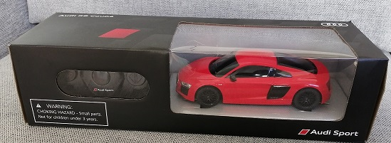
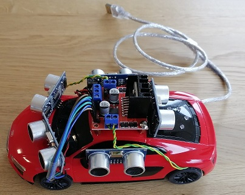
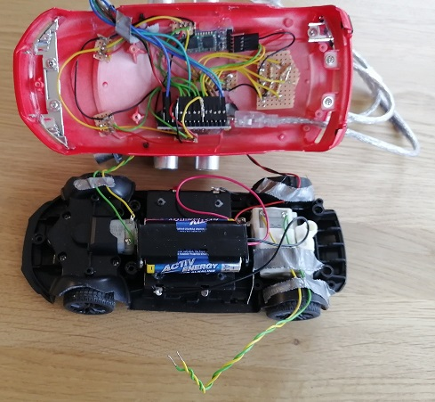
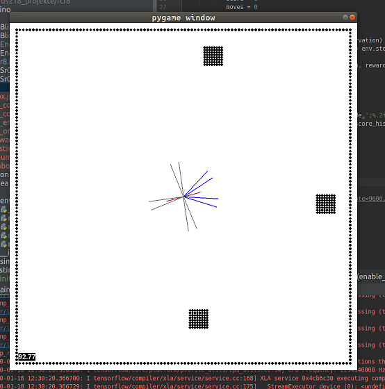

## Goal (work in progress)

The goal of this project is to turn a rc car into a self driving car using reinforcement learning

       

## Hardware

#### Hardware compenents
* Audi R8 remote controlled  car
* Arduino nano
* 5 HC-SR04 Ultrasonic Sensor
* HC-05 / HC-06 Bluetooth Module
* 5 Led
* L298 Motor Driver Module
* AA Battery holder for 2 batteries
* Some resistors

#### The wiring
1) Open the rc car and remove everything but the motors
1) Add the battery holder. It should be connected in series with the existing 3 battery holders to achieve a Voltage of 7.5V

1) Add the Arduino. The VIN pin of the Arduino is used to power the Arduino using the 7.5 Volt. All components except of the L298 will be powered using the 5 Volt output of the Arduino.
1) Install the L298 Motor Driver Module. The L298 is also connected directly to the 7.5 Volt. The enable pins must be connected with analog pins.
1) Install the SR 04: 
In order to save some pins on the Arduino, all SR04 sensors share the same trigger pin. This way all SR04 will send the Trigger signal then reading the distances.
vin and gnd are connected to the Arduino 5V out / gnd.
1) Install the leds. Each led gets its own output pin as well. gnd is connected to the Arduino gnd.
1) The HC-05 is also connected to the Arduino. Nothing special here

As the arduino nano has not enough digital pins for this setup, some analog pins need to be used as digital pins. 

The pins need to be specified in r8.ino.

#### The communication

The serial communication is specified using processRcMessage() on Arduino side and r8.py on Python side. Python sends the following commands to the r8 

* d 
    * Description: Request the current sensor data from 
    * Response: Five byte containing the distance in cm measured by each sensor. The order is: front right, right, back, left, front left
* a value
    * Description: value must be 0, 1 or 2. This command requests the r8 to drive backwards(0), stop(1) or drive forwards(2) 
    * Respones: None
* s value
    * Description: value must be 0, 1 or 2. This command requests the r8 to steer left(0), not(1) or right(2) 
    * Respones: None
    
## Software / The repo

The repo is split into an arduino folder containing the code that runs on the car, and an python folder running on the machine used to train the model
All libraries used to control the components connected to the Arduino ard written in cpp, the main program is a Arduino sketch.
Python libraries used:
* numpy
* keras (on tensorflow)
* pygame
* openai gym

## The training

As it would take long to train the network using the car, I have added a openai gym environment (r8_virtual_env.py) to pre-train the model without having to use the car. 
After the virtual pre training is done, it should be easier / faster for the Agent to learn how to drive the actual car.

## Open Issues:

[    ] Read the distances of the SR04 Sensors simultaneously
This way the distance measurements will be much faster. In order to to so, the echo signal must not be measured using pulseIn. It should be a loop checking all echo pins for the state high.

[    ] In the current setup speed is a constant. It could be also a metric output of the model

[    ] Add python library setup to the repo 

[    ] Pre trained agents work very poor on the actual car.
The order of the input an output vector of r8_env and r8_virtual_env seem to be fine. Maybe it just some fine tuning in the behaviour of the virtual environment.

[    ] Move constants out of code

[    ] Training for a long time results in:

Traceback (most recent call last):
  File "/home/ske/ds218_projekte/rcr8/python/main_rl.py", line 48, in <module>
    train(env, 2500)
  File "/home/ske/ds218_projekte/rcr8/python/main_rl.py", line 36, in train
    agent.learn()
  File "/home/ske/ds218_projekte/rcr8/python/rl/simple_agent.py", line 97, in learn
    self.memory.get_sample(self.batch_size)
  File "/home/ske/ds218_projekte/rcr8/python/rl/simple_agent.py", line 55, in get_sample
    actions = self.mem_action[batch]
IndexError: index 1000041 is out of bounds for axis 0 with size 1000000
